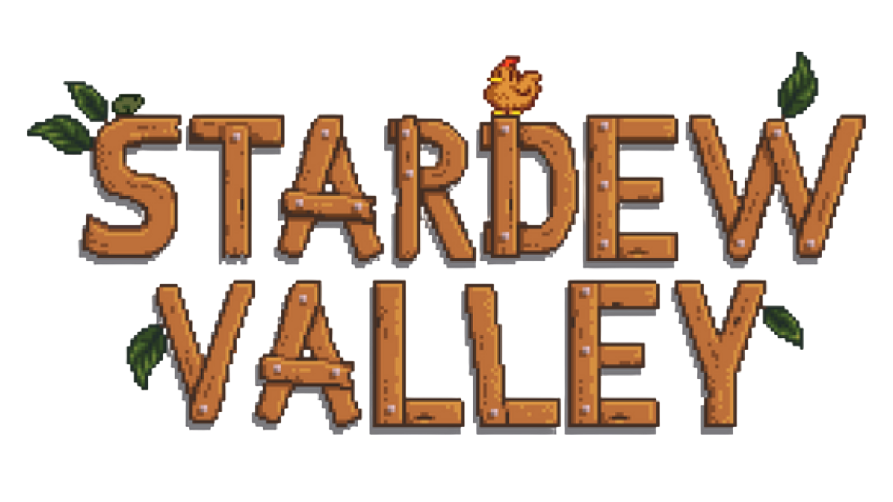

# 🌾 Stardew Valley - Guia do Centro Comunitário 🧑‍🌾

  

  
  
  
  
  

---

## 📖 Sobre o Projeto

Este projeto é um guia interativo completo para auxiliar jogadores de **Stardew Valley** na jornada de restauração do Centro Comunitário. Desenvolvido como parte do meu aprendizado em **Análise e Desenvolvimento de Sistemas (IFBA)**, o sistema une a nostalgia do pixel art com uma arquitetura moderna e escalável.

Acesse aqui: https://stardewvalley-guia.vercel.app

O guia permite visualizar todos os conjuntos (bundles), as salas do centro e os itens necessários, com informações detalhadas consumidas diretamente de uma API personalizada.

---

## 🚀 Tecnologias Utilizadas

O projeto foi construído utilizando uma arquitetura **Fullstack**:

### 🍁​​ **Frontend**
- **React.js**: Construção de componentes modulares e reutilizáveis.
- **Tailwind CSS**: Estilização responsiva e personalizada com utilitários.
- **Vite**: Ferramenta de build rápida para o ecossistema React.
- **React Router Dom**: Gerenciamento de rotas e navegação entre páginas.

### 🪴​ **Backend**
- **Java & Spring Boot**: Criação de uma API RESTful robusta.
- **Spring Data JPA & Hibernate**: Mapeamento objeto-relacional para persistência.
- **PostgreSQL**: Banco de dados relacional para armazenamento dos itens e conjuntos.

### 🐥​**Deploy & Ferramentas**
- **Vercel**: Hospedagem do frontend (com CI/CD automático).
- **Render**: Hospedagem do backend e banco de dados.
- **Git/GitHub**: Controle de versionamento e organização.

---

## 🛠️ Funcionalidades

- [x] **Navegação imersiva**: Interface temática que remete ao menu do jogo.
- [x] **Consulta em tempo real**: Descrições e métodos de obtenção de itens buscados via API.
- [x] **Responsividade Total**: O guia funciona perfeitamente em computadores e dispositivos móveis.
- [x] **Tratamento de Cold Start**: Interface preparada para aguardar o despertar do servidor gratuito.

---

# 🎨 Layout

## Mobile 
  

    
  

  
---

## Computador (1920x1080)

> 🌱 Estilos fieis ao jogo

   

    
  

    
  

  

    
  

> **Link do Projeto:** [Acesse o Guia aqui!](https://SEU-LINK-DA-VERCEL.vercel.app)

---

## 🏗️ Arquitetura do Sistema

O projeto segue a separação de responsabilidades (SoC):
1. O **Frontend** (React) solicita os dados conforme a navegação do usuário.
2. O **Backend** (Spring Boot) processa as requisições e consulta o **Banco de Dados** (PostgreSQL).
3. A resposta retorna em formato JSON, sendo tratada e exibida em modais dinâmicos no React.

---

## 👩‍🌾 Desenvolvedora

| [ Ketlin Oliveira](https://github.com/KetlinOlliveira) |
| :---: |

| Estudante de ADS no IFBA, apaixonada por transformar código em experiências imersivas. |

---

## 📝 Licença

Este projeto é para fins educacionais. Stardew Valley é uma marca registrada da **ConcernedApe**.

---

  Cultivado com ❤️ e muito café (ou chá de frutas) ☕

